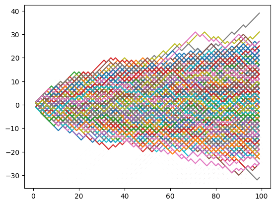
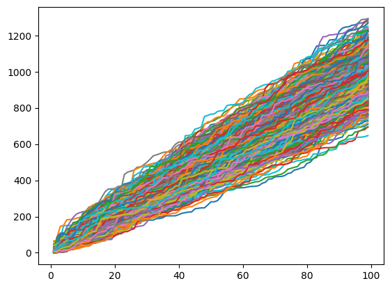

## Approach
### Code Block 1
Imported numpy to generate random integers and matplotlib.pyplot to graph our result
### Code Block 2(Using Normal distribution)

We set total no. of steps N to 100 and define  two empty arrays X and Y two store the values of X coordinate and Y coordinate after each step.
We initialize a variable x=0 to store position after each step

```python
for i in range(0,N): 
  rng = np.random.default_rng()
  e=rng.choice([-1,1])
```
Here we generate random value e, which is either -1 or 1 randomly for N-1 steps 

```python
  x+=e
  X.append(i)
  Y.append(x)
```
After each iteration the iteratiion number is stored in X and the position is updated by ` x+=e ` 
```python
plt.plot(X,Y)
```
The entire process is included in a loop that runs 1000 times and plotted together using plt.show() in a single graph


## Output



### Code Block 3(Using exponential distribution)

We set total no. of steps N to 100 and define  two empty arrays X and Y two store the values of X coordinate and Y coordinate after each step.
We initialize a variable x=0 to store position after each step

```python
for i in range(0,N): 
  e=np.random.exponential(10)
```
Here we generate random value e, which is either -1 or 1 randomly for N-1 steps 

```python
  x+=e
  X.append(i)
  Y.append(x)
```
After each iteration the iteratiion number is stored in X and the position is updated by ` x+=e ` 
```python
plt.plot(X,Y)
```
The entire process is included in a loop that runs 1000 times and plotted together using plt.show() in a single graph


## Output


