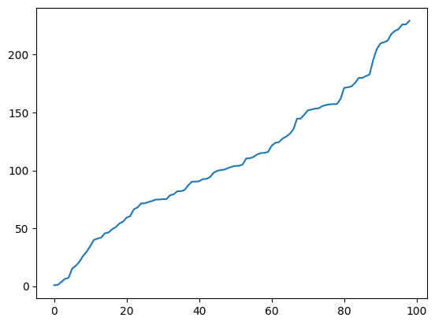

## Approach - random walk
First, we defined a function to plot a single random path. We create an array, generate N random integers that are either -1 or 1, eliminating 0 with a simple while loop.
We then create another array which stores the sum of these random values for 1 to N steps taken. 
Plotting this array generates a random path everytime.

Next, we define a function to plot multiple random paths.

## Exponential distribution

Using numpy.random.exponential(x) where x is the inverse of rate for the exponential distribution, we generate a random variable from the distribution. We then create a array with the successive sum of these random variables and plot them like before
Then we again plot multiple such paths.

