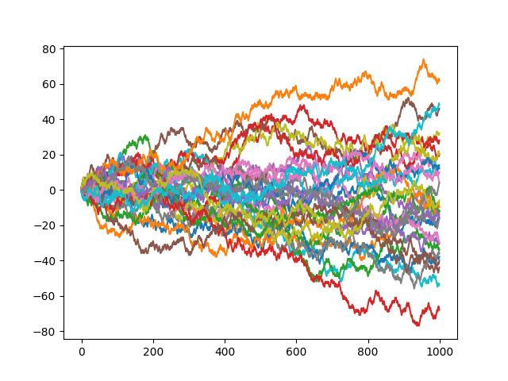
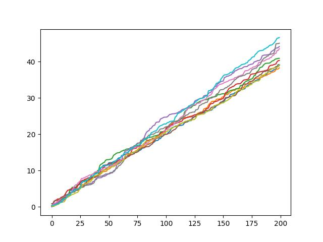

PROBLEM 1:
i have firstly created random array of 100 integers in range (-100,100) then if value is >0 changed it to 1 else to 0.
now i added all the values and plotted x vs no. of steps.
now we plot multiple random walks and we notice that avg of all the walks is nearly zero.

PROBLEM 2:
firstly i stored an array of random  exponential distribution in x and then i plotted the summation of individual terms of array on the graph and found nearly straight line.

