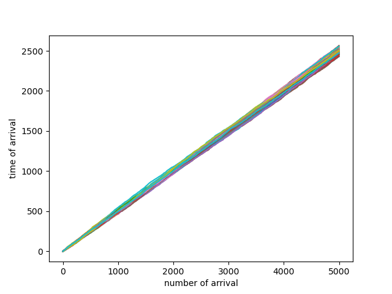

## random walk
generating random numbers from 0 and 1 and moving ahead by 1 (increamenting pos) in case of generated number > 0.5 and 1 behind if < 0.5 then adding them to get the position and append it to a list and then plot it against steps

## random walk 2D
generating a random angle from 0 to 2 pi moving one unit in that direction using sin and cosine functions and appending x and y to a list and plotting them

## poission process
generating a sample from exponenetial distribution and summing it to the time of arrival to get the cumilative, appending it to a list and plotting 
