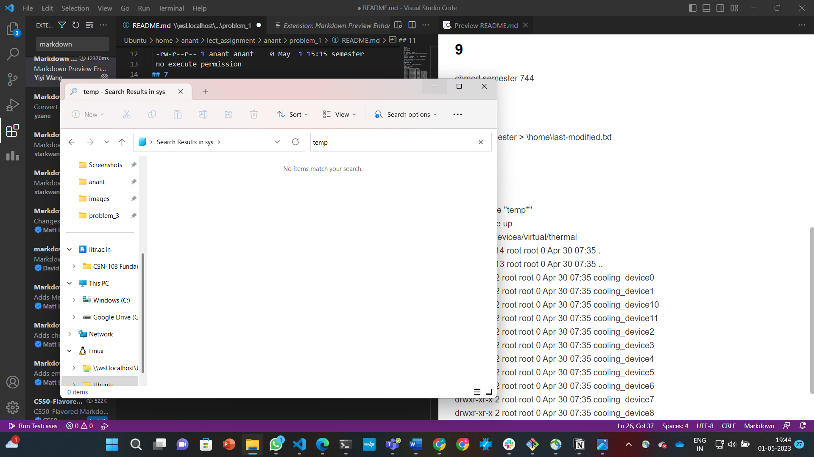

## 2
 cd /tmp
 mkdir missing
## 3
 cd missing
 touch semester
## 4
echo '#!/bin/sh' > semester
echo 'curl --head --silent https://missing.csail.mit.edu' >> semester
## 6
 ls -la 
 -rw-r--r-- 1 anant anant    0 May  1 15:15 semester
 no execute permission
## 7
 because the interpreter has to read the file only
## 8
 man chmod;chmod --help
## 9
chmod semester 744
## 10
date -r semester > \home\\last-modified.txt
## 11
 cd /sys
 find . -iname "temp" 
 no file came up
 ls -la /sys/devices/virtual/thermal
 drwxr-xr-x 14 root root 0 Apr 30 07:35 .
 drwxr-xr-x 13 root root 0 Apr 30 07:35 ..
 drwxr-xr-x  2 root root 0 Apr 30 07:35 cooling_device0
 drwxr-xr-x  2 root root 0 Apr 30 07:35 cooling_device1
 drwxr-xr-x  2 root root 0 Apr 30 07:35 cooling_device10
 drwxr-xr-x  2 root root 0 Apr 30 07:35 cooling_device11
 drwxr-xr-x  2 root root 0 Apr 30 07:35 cooling_device2
 drwxr-xr-x  2 root root 0 Apr 30 07:35 cooling_device3
 drwxr-xr-x  2 root root 0 Apr 30 07:35 cooling_device4
 drwxr-xr-x  2 root root 0 Apr 30 07:35 cooling_device5
 drwxr-xr-x  2 root root 0 Apr 30 07:35 cooling_device6
 drwxr-xr-x  2 root root 0 Apr 30 07:35 cooling_device7
 drwxr-xr-x  2 root root 0 Apr 30 07:35 cooling_device8
 drwxr-xr-x  2 root root 0 Apr 30 07:35 cooling_device9
- only cooling devices came up. Concluded no keeping of temperature.

