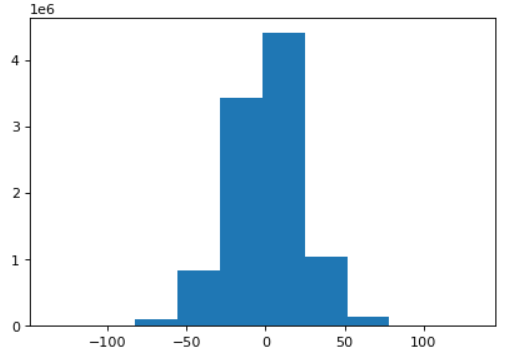
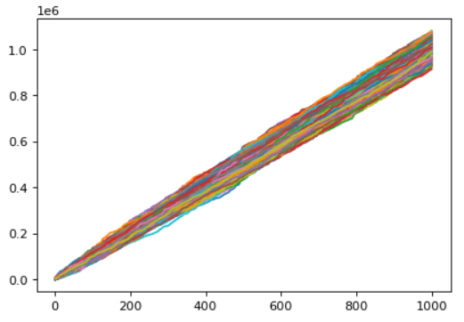

### Method
**1st Cell:**
    I have taken 1000 values of a using a random command that gives either 0 or 1, multiplying this by 2 and subtracting 1 from it, gives us -1 and 1, we then take the cumulative sum of this array to give us our random walk. To show that this follows the central limit theorem, i have taken 10000 such arrays and ploted their histogram to show that, the number of times each point reached in the walk, follows a normal distibution about zero mean.
    

    
**2nd Cell:**
    Now instead of considering that the person can walk a consatnt distance in discrete walk, we are taking the distance out of an exponential distribution.The 2nd cell plots 1000 such random walks as a line plot.
    

    

### Structure
    .
    └── pre_lecture_stats_1
        ├── README.md
        └── pre_lecture_1_shorya.ipynb
